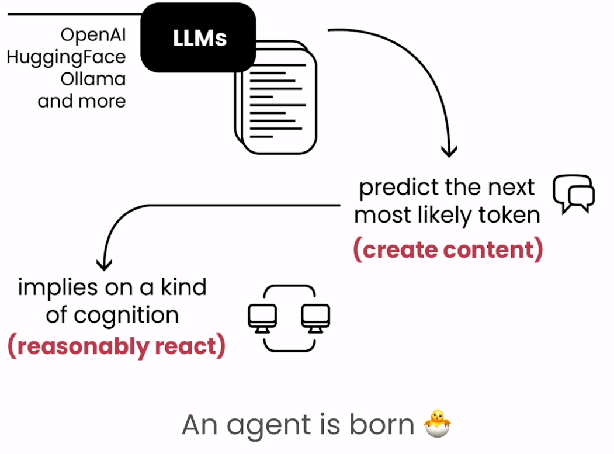
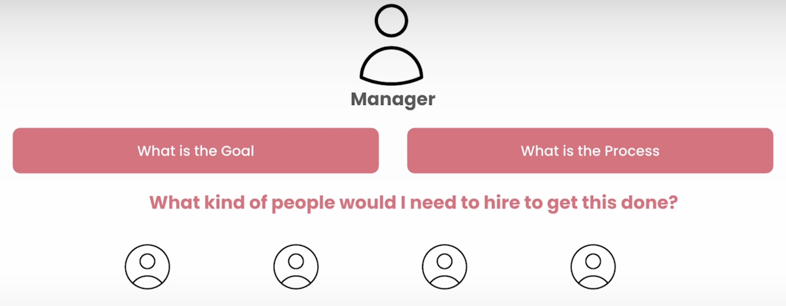
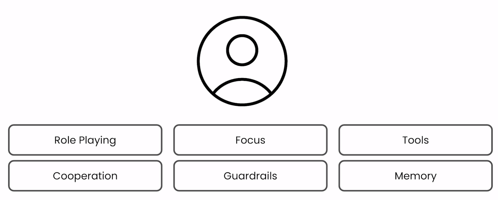
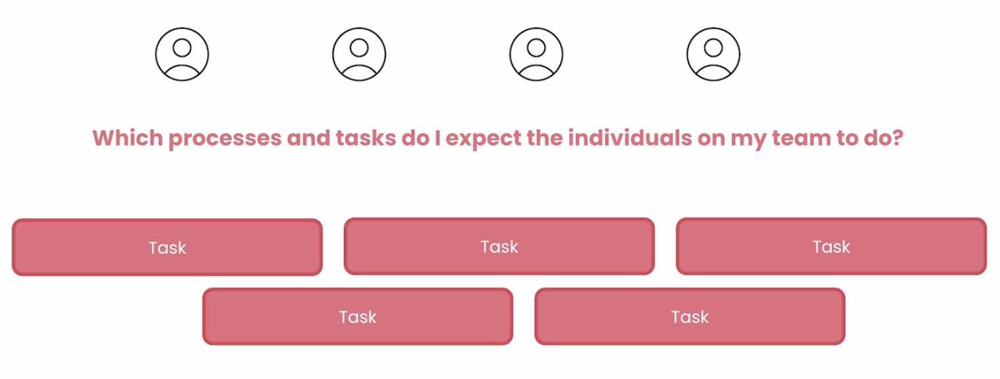
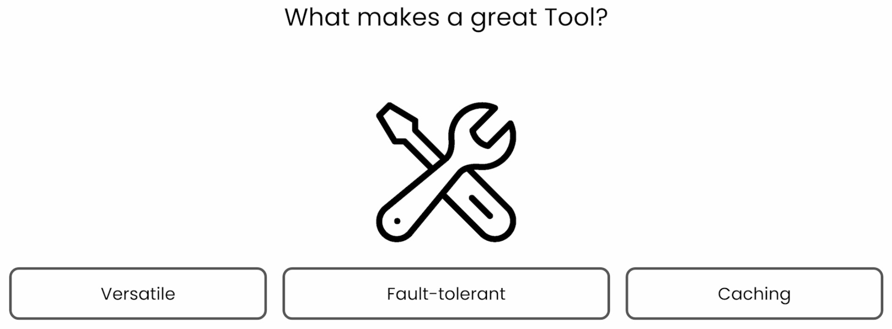
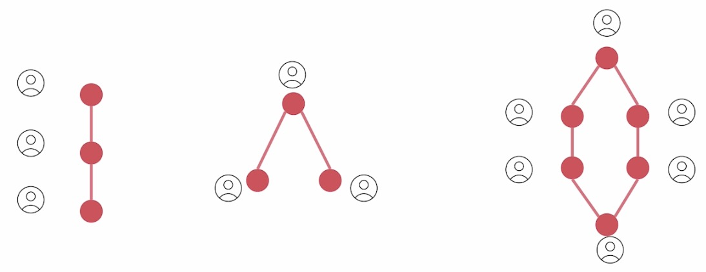

# CrewAI Concepts

CrewAI is a multi-agent system framework designed to simplify the deployment and management of AI agents working collaboratively to achieve complex tasks. The core concept revolves around creating a "crew" of agents, each with specialized roles and capabilities. These agents can communicate and cooperate seamlessly, enabling them to handle tasks that would be challenging for a single AI agent to accomplish alone.

 

At the heart of CrewAI is the concept of modularity, where each agent is a self-contained module with specific expertise. This modular approach allows for flexibility in building AI systems, as developers can mix and match agents based on the requirements of the task at hand. The framework also supports scalability, allowing developers to easily add or remove agents as the complexity of the task evolves.

CrewAI also emphasizes the importance of coordination and communication between agents. Through a well-defined protocol, agents can share information, delegate tasks, and make decisions collectively. This collaborative approach not only enhances the efficiency of the AI system but also makes it more resilient and adaptable to dynamic environments.

## Think as a Manager

 

**"Imagine creating agents as if you were hiring a team.** 

When building multi-agent systems, it’s crucial to design agents that excel. Think of yourself as a manager. Managers excel at defining goals and processes. Apply this mindset to your agents. 

**Focus on the desired outcome and the steps needed to achieve it.** Then, envision the ideal team members for this task. What roles, backgrounds, and objectives would they have? 

By adopting this managerial perspective, you’ll create agents that are more effective and aligned with your overall goals." 

## Agent, a Person

 

Creating effective multi-agent systems requires considering several factors. Six fundamental pillars stand out in this process:

1. Role Playing
* **Customization:** Assigning specific roles to agents, as if they were people on a team, directly influences the quality of responses.
* **Context:** Defining a context and a "backstory" for each agent enriches the interaction and relevance of the responses.

2. Focus
* **Specific tasks:** Each agent should have a well-defined task to avoid information overload and improve accuracy.
* **Avoiding generalization:** Instead of an "all-powerful" agent, it's preferable to have multiple specialized agents.

3. Appropriate Tools
* **Right equipment:** Providing agents with the necessary tools for their tasks prevents confusion and inefficiency.
* **Avoiding overload:** An excess of tools can compromise performance, especially in smaller models.

4. Cooperation
* **Teamwork:** The ability of agents to collaborate, exchange information, and delegate tasks leads to superior results.
* **Simulation of conversations:** The cooperation between agents simulates the refinement process that occurs in human conversations.

5. Guardrails
* **Security:** Implementing mechanisms to prevent unwanted behaviors, such as hallucinations and infinite loops.
* **Consistency:** Ensuring reliable and consistent results through clear guidelines.

6. Memory
* **Learning and retention:** The ability to remember past interactions allows agents to learn and improve continuously.
* **Types of memory:** Short-term, long-term, and entity memory are important for different purposes.

**Conclusion**

By considering these six pillars, developers can create more robust, adaptable, and capable multi-agent systems to handle complex challenges. The combination of customization, focus, appropriate tools, cooperation, security, and memory is fundamental to the success of these systems.

## Efficient Task 

 

Multi-agent systems (MAS) are integral in automating complex tasks, where multiple agents work together to achieve a common goal. Task management is crucial in these systems, and crewAI offers a robust framework for optimizing this process. Here’s a concise overview of the key aspects:

1. **Defining the System**: Start by establishing the overall objective, like organizing an event. Agents can be assigned specific roles, such as finding a venue or managing catering.

2. **Task Importance**: Tasks are the foundation of MAS. Clearly defining what each agent is responsible for ensures the system functions smoothly.

3. **Task Creation**: Clearly describe the task and set expectations for the outcome. This clarity helps agents perform their roles effectively.

4. **CrewAI’s Mandatory Attributes**: crewAI requires a task description and an expected outcome, ensuring tasks are well-defined and executable.

5. **Additional Parameters**: crewAI allows for additional customization, such as setting context, defining callbacks, and enabling parallel task execution.

6. **Optimizing Success**: The complexity of your MAS will dictate the level of detail needed. Proper task management ensures agents perform efficiently, leading to a successful system.

In summary, effective task management is essential in MAS. By leveraging crewAI, you can create well-defined tasks that set your agents up for success, ensuring your system achieves its goals.

## Effective Tools

 

Tools play a crucial role in enabling agents to communicate with the outside world. crewAI offers a robust framework for implementing effective tools. Here’s a concise overview of the key aspects:

1. **Versatility**: Tools must handle various types of requests and convert inputs appropriately to interact effectively with both AI applications and external systems.

2. **Fault Tolerance**: Effective tools should handle exceptions gracefully without halting agent execution. crewAI supports fault tolerance by allowing tools to self-heal and manage errors without stopping the entire system.

3. **Caching**: Implementing caching is crucial to avoid unnecessary API calls, reduce execution time, and improve system efficiency. crewAI offers cross-agent caching to optimize performance and resource usage.

##  Work Together

In CrewAI, processes orchestrate the execution of tasks by agents, akin to project management in human teams. These processes ensure tasks are distributed and executed efficiently, in alignment with a predefined strategy.

 

One of the main challenges in managing multi-agent systems is selecting the appropriate collaboration method. Depending on the context and objectives, agents can operate sequentially, in parallel, or hierarchically. Each of these methods offers distinct advantages:

- **Sequential:** Allows each agent to complete a task and pass the result to the next agent, ideal for linear workflows.
- **Parallel:** Facilitates the simultaneous execution of tasks by different agents, speeding up the process in scenarios that demand quickness.
- **Hierarchical:** A managing agent delegates and reviews the work of other agents, ensuring consistency and the achievement of the initial goal.

## The Flexibility of crewAI

crewAI stands out for its flexibility in supporting these different collaboration methods, adapting to the needs of the project. Additionally, the platform allows agents to perform tasks asynchronously and cooperate more dynamically, which is crucial in scenarios where adaptability is required.

## References

- [Multi AI Agent Systems with crewAI](https://www.deeplearning.ai/short-courses/multi-ai-agent-systems-with-crewai/)
- [crewAI](https://www.crewai.com/)
- [crewAI Documentation](https://docs.crewai.com/)