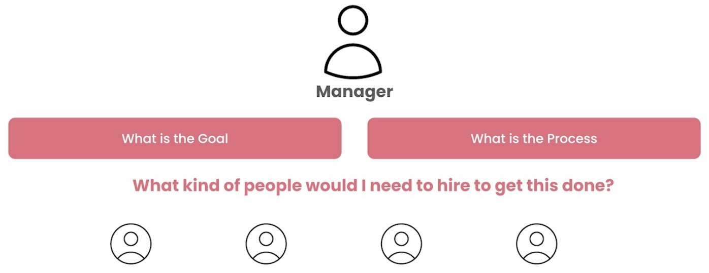

# CrewAI concepts

CrewAI is a multi-agent system framework designed to simplify the deployment and management of AI agents working collaboratively to achieve complex tasks. The core concept revolves around creating a "crew" of agents, each with specialized roles and capabilities. These agents can communicate and cooperate seamlessly, enabling them to handle tasks that would be challenging for a single AI agent to accomplish alone.

 

At the heart of CrewAI is the concept of modularity, where each agent is a self-contained module with specific expertise. This modular approach allows for flexibility in building AI systems, as developers can mix and match agents based on the requirements of the task at hand. The framework also supports scalability, allowing developers to easily add or remove agents as the complexity of the task evolves.

CrewAI also emphasizes the importance of coordination and communication between agents. Through a well-defined protocol, agents can share information, delegate tasks, and make decisions collectively. This collaborative approach not only enhances the efficiency of the AI system but also makes it more resilient and adaptable to dynamic environments.

## Building Effective Multi-Agent Systems: 6 Essential Pillars

 

Creating effective multi-agent systems requires considering several factors. Six fundamental pillars stand out in this process:

### 1. Role Playing
* **Customization:** Assigning specific roles to agents, as if they were people on a team, directly influences the quality of responses.
* **Context:** Defining a context and a "backstory" for each agent enriches the interaction and relevance of the responses.

### 2. Focus
* **Specific tasks:** Each agent should have a well-defined task to avoid information overload and improve accuracy.
* **Avoiding generalization:** Instead of an "all-powerful" agent, it's preferable to have multiple specialized agents.

### 3. Appropriate Tools
* **Right equipment:** Providing agents with the necessary tools for their tasks prevents confusion and inefficiency.
* **Avoiding overload:** An excess of tools can compromise performance, especially in smaller models.

### 4. Cooperation
* **Teamwork:** The ability of agents to collaborate, exchange information, and delegate tasks leads to superior results.
* **Simulation of conversations:** The cooperation between agents simulates the refinement process that occurs in human conversations.

### 5. Guardrails
* **Security:** Implementing mechanisms to prevent unwanted behaviors, such as hallucinations and infinite loops.
* **Consistency:** Ensuring reliable and consistent results through clear guidelines.

### 6. Memory
* **Learning and retention:** The ability to remember past interactions allows agents to learn and improve continuously.
* **Types of memory:** Short-term, long-term, and entity memory are important for different purposes.

**Conclusion**

By considering these six pillars, developers can create more robust, adaptable, and capable multi-agent systems to handle complex challenges. The combination of customization, focus, appropriate tools, cooperation, security, and memory is fundamental to the success of these systems.

## Think as a Manager

 

### **"Imagine creating agents as if you were hiring a team.** 

When building multi-agent systems, it’s crucial to design agents that excel. Think of yourself as a manager. Managers excel at defining goals and processes. Apply this mindset to your agents. 

### **Focus on the desired outcome and the steps needed to achieve it.** Then, envision the ideal team members for this task. What roles, backgrounds, and objectives would they have? 

By adopting this managerial perspective, you’ll create agents that are more effective and aligned with your overall goals." 
